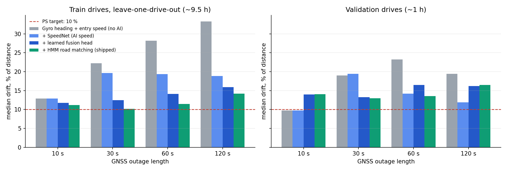
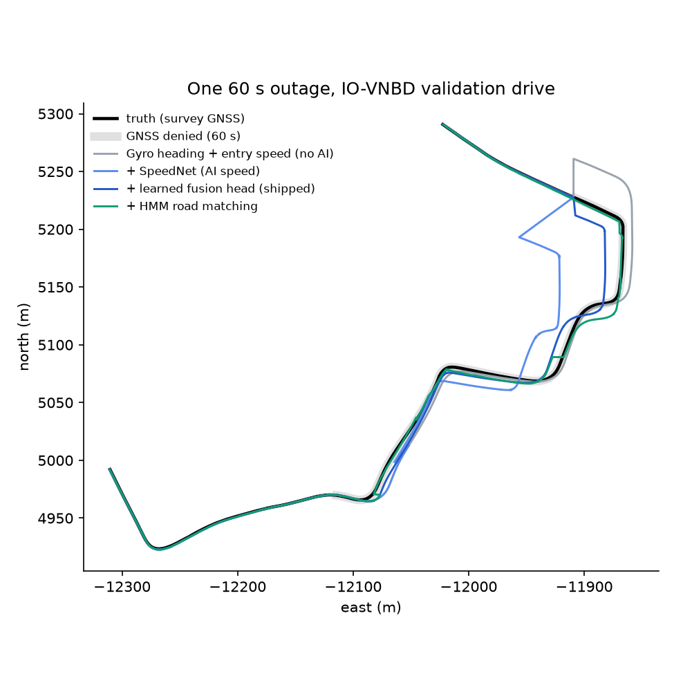

# OffMaps

**AI dead reckoning that keeps a phone navigating when GNSS drops.**
Smart India Hackathon 2026, PS 26168: *AI-ML based Intelligent Dead Reckoning System for
Seamless Navigation* (ISRO, Smart Vehicles, Software).

In a tunnel, an underpass, a basement car park or between tall buildings, the phone
loses GNSS and the navigation dot freezes or jumps. OffMaps keeps the dot moving
using only the phone's own sensors:
- the gyroscope carries the heading;
- a neural network, SpeedNet, reads vehicle speed from accelerometer and gyro
  vibration, replacing the missing speedometer;
- a learned fusion head decides how much to trust that speed;
- an error-state Kalman filter (ESKF) fuses all of it with GNSS and NavIC whenever
  they are available.

GNSS is only ever a correction, never a mode switch, so there is no jump when it
returns. Everything runs offline, on the phone, with no extra hardware.

| | |
|---|---|
| **Runs on** | a native Android app (Kotlin + a C++17 core over JNI), live on a Redmi Note 9 Pro at 400 Hz; and an edge-engine CLI for external IMUs at any rate |
| **Validated on** | real drives from [IO-VNBD](https://github.com/onyekpeu/IO-VNBD): ~14 h, phone IMU scored against the vehicle's survey GNSS, split by drive |
| **Where it stands** | Median drift, % of distance, on train drives run with models that never saw them: **24.2 %** with no AI, **13.6 %** with SpeedNet + the fusion head, **11.7 %** with road matching as the app now ships. **16.4 %** on the held-out test drives (scored before road matching shipped). The PS target of **< 10 % is not reached yet** (§Results). |
| **Watch it** | **[sri-venkat-22.github.io/OffMaps](https://sri-venkat-22.github.io/OffMaps/)**: replay any validation-drive outage on the real roads, all four stages side by side |
| **Try it** | `./run.sh` builds, tests and runs the demo (§Quick start) |

## Results

Each stage adds one component to the live loop the phone runs (`py/edge_engine.py`, the
host twin of `FusionEngine.kt`). The protocol:
- GNSS is removed for 10, 30, 60 or 120 s, after at least 3 minutes of GNSS;
- the error at the last GNSS-denied sample is divided by the distance driven;
- the table shows the median over outages;
- every stage sees the identical outage windows.

`py/ablation.py` produces all numbers below; the raw per-outage data is in `out/ablation/`.

**Train drives, leave-one-drive-out (~9.5 h; every drive run with models that never saw it)**

| stage | 10 s | 30 s | 60 s | 120 s | mean | < 10 % (30 / 60 s) |
|---|--:|--:|--:|--:|--:|--:|
| Gyro heading + entry speed (no AI) | 12.9 | 22.3 | 28.2 | 33.3 | **24.2** | 21 / 14 % |
| + SpeedNet (AI speed) | 12.9 | 19.6 | 19.4 | 18.9 | **17.7** | 19 / 21 % |
| + learned fusion head | 11.7 | 12.5 | 14.1 | 15.9 | **13.6** | 33 / 35 % |
| + HMM road matching (shipped) | 11.2 | 10.1 | 11.5 | 14.2 | **11.7** | 49 / 47 % |

Outages per duration: 392 / 365 / 338 / 294. Median drift % of distance.

Paired step, outage by outage (median change in points [90 % bootstrap CI], share of outages better):

- + SpeedNet (AI speed): 10 s +0.0 [+0.0, +0.0], 0 %; 30 s -0.8 [-3.2, +1.2], 51 %; 60 s -7.3 [-9.6, -4.2], 65 %; 120 s -11.2 [-13.5, -7.7], 70 %
- + learned fusion head: 10 s -1.4 [-2.1, -0.8], 59 %; 30 s -4.9 [-5.9, -3.5], 72 %; 60 s -2.5 [-3.4, -1.3], 62 %; 120 s -1.7 [-2.3, -1.0], 62 %
- + HMM road matching (shipped): 10 s +0.0 [-0.0, +0.1], 48 %; 30 s -2.3 [-2.5, -1.5], 72 %; 60 s -1.1 [-1.6, -0.8], 66 %; 120 s -0.5 [-0.8, -0.3], 64 %

**Validation drives (2 drives, ~1 h)**

| stage | 10 s | 30 s | 60 s | 120 s | mean | < 10 % (30 / 60 s) |
|---|--:|--:|--:|--:|--:|--:|
| Gyro heading + entry speed (no AI) | 9.7 | 19.0 | 23.2 | 19.4 | **17.8** | 36 / 28 % |
| + SpeedNet (AI speed) | 9.7 | 19.4 | 14.2 | 11.9 | **13.8** | 30 / 33 % |
| + learned fusion head | 14.0 | 13.2 | 16.4 | 16.2 | **15.0** | 32 / 26 % |
| + HMM road matching (shipped) | 14.0 | 13.0 | 13.5 | 16.4 | **14.2** | 30 / 28 % |

Outages per duration: 50 / 44 / 43 / 33. Median drift % of distance.

Paired step, outage by outage (median change in points [90 % bootstrap CI], share of outages better):

- + SpeedNet (AI speed): 10 s +0.0 [+0.0, +0.0], 0 %; 30 s +1.3 [-4.1, +7.2], 43 %; 60 s -3.2 [-14.1, +1.7], 58 %; 120 s -5.1 [-12.9, -0.6], 67 %
- + learned fusion head: 10 s -0.2 [-2.0, +3.3], 52 %; 30 s -3.6 [-12.2, +0.6], 61 %; 60 s -0.4 [-6.4, +2.8], 51 %; 120 s -0.1 [-4.1, +3.7], 52 %
- + HMM road matching (shipped): 10 s -0.1 [-0.8, +0.0], 58 %; 30 s -0.1 [-0.4, +0.2], 55 %; 60 s -0.0 [-0.3, +0.0], 53 %; 120 s -0.2 [-0.6, +0.0], 64 %

Notes on the tables:
- At 10 s, SpeedNet equals the no-AI stage by construction: the hand rule holds the
  Doppler speed for the first 10 s.
- The train-set numbers for the last two stages carry some selection optimism. The
  fusion head's inputs and epoch count were chosen by cross-validation on these drives,
  and the map's χ² gate was added after seeing their worst outages. Validation had no such
  selection, but at ~1 h it is too small to separate the stages: its paired intervals
  include zero for the fusion head and the map.



**Reading it:**
- **SpeedNet is the big step.** Speed, not heading, drives dead-reckoning error: the phone
  gyro follows every turn, so the AI works on speed. It cuts the 60–120 s drift by
  7–11 points per outage at 60–120 s (paired) on the train drives.
- **The learned fusion head** predicts speed and its own σ from a GRU, which acts as an
  adaptive Kalman update. It helps most on the train drives. On the 1 h validation set
  it is behind SpeedNet alone, and on the test drives it tied the hand-tuned rule
  (Phase 8). It ships because the larger held-out evidence favours it.
- **Road matching** (HMM on the real OpenStreetMap network) mainly removes cross-track
  error. At the end of an outage most of the error is along the road, which is speed
  again, so the map's gain is capped (`py/phase9_map_eval.py`, `out/phase9/`).
- **Held-out test drives**, scored once, after every choice was fixed: 13.5 / 15.3 / 17.1 /
  19.6 % at 10 / 30 / 60 / 120 s, mean **16.4 %** (`out/phase8/test.json`). The test split has
  been looked at five times in total; nothing was ever chosen on it.
- **Not yet under 10 %.** The remaining lever is speed data from the target phone. The
  IO-VNBD phone's accelerometer barely tracks the car (correlation 0.02–0.5), and every
  model here learned from 2 drivers. The app records every session, and `score_drive.py`
  scores a new phone's drive in one command.



Other measured properties (each one is produced by the script or pinned by the test named):

| | result | source |
|---|---|---|
| Error 10 s after GNSS returns | ≤ 1.7 m (no jump on re-lock) | `py/phase6_check.py` |
| Edge engine throughput, 200 Hz FOG | ~280× real time on one CPU thread | `py/edge_bench.py`, `out/edge_bench.json` |
| Phone re-mounted mid-drive | detected at once, re-levelled in 0.4 s | `py/phase4_gates.py` (gate 2) |
| Spoofed GNSS with high C/N₀ | rejected; flag at onset, zero false positives | `py/phase4_gates.py` (gate 3) |
| Heading, two-wheeler leaning up to 31° | 5.4° median error at outage end (14.3° without lean compensation) | `py/phase8_heading_gate.py` |
| Parked start, no GNSS course | magnetometer heading seed, 17° median (82° without) | `py/phase8_heading_gate.py` |
| C++ core vs Python reference | equal to 1e-9–1e-12 (parity tests) | `py/tests/` |

## PS 26168: requirement by requirement

✅ done and measured · 🟡 done with a stated limit · ❌ not done

| # | The PS asks for | OffMaps | |
|---|---|---|---|
| 1 | Train and test on **IO-VNBD**, with position plots | Loader that fixes the dataset's quirks (unaligned phone/vehicle clocks, yaw gyro in the column labelled "Pitch", km/h that is m/s); drive-level train / val / test split; reports and plots | ✅ `REALDATA.md` |
| 2 | **AI predicts vehicle speed** from phone accelerometer + gyro only | SpeedNet: TCN + GRU, speed + σ (+ motion class), trained on real drives, 620 KB ONNX; online Doppler self-calibration (Deming fit) | ✅ `py/model/`, `core/speed_cal.cpp`, `py/README_PHASE2.md` |
| 3 | Filter **engine vibration, potholes, bumps** | 200–400 Hz shock detector + pothole-robust vibration RMS in the core | ✅ `core/vib.cpp`, `py/phase7c_gate.py` |
| 4 | Detect **phone misalignment** on the mount | CUSUM re-mount detector, re-levels in 0.4 s, resets the learnt forward axis | ✅ `core/align.cpp`, `py/phase4_gates.py` |
| 5 | **Alignment and calibration**: phone pitch, roll, yaw vs the car | Gravity levelling; GNSS-aided forward-axis fit (sign included); gyro bias in the filter | ✅ `py/heading_aids.py`, `nav/HeadingAids.kt` |
| 6 | **Map matching** on an offline map (OSM, e.g. HMM) | Offline OSM basemap + road network on the phone (Hyderabad); HMM matcher with route-distance transitions, on the phone and the edge engine: 13.6 → 11.7 % on train drives | ✅ `py/road_hmm.py`, `nav/RoadHmm.kt`, `py/phase9_map_eval.py` (not yet confirmed on a real Redmi drive) |
| 7 | **Non-holonomic constraints** | Structural in the planar ESKF (velocity along heading); explicit NHC update in the 3D 16-state ESKF | ✅ `core/idr.h` |
| 8 | **AI-based GNSS + INS fusion** | Learned fusion head: speed and its noise from a GRU, fed to the ESKF as an adaptive measurement | ✅ `py/model/fusion_head.py`, `nav/FusionHead.kt` |
| 9 | **Seamless GNSS handler**, switch within milliseconds | No mode switch: continuous GNSS trust (C/N₀, satellites, DOP, χ², NavIC-weighted) scales the measurement noise; ≤ 1.7 m 10 s after re-lock | ✅ `core/gnss_quality.cpp`, `py/phase6_check.py` |
| 10 | **Mobile app** with real-time UI and uninterrupted vehicle icon | Native Android app: offline map, live dot and heading, GNSS/DR mode, live drift vs the 10 % line, outage simulator, drive recorder | ✅ `android/` |
| 11 | **On-device inference** | ONNX Runtime Mobile + the C++ core over JNI; no network | ✅ |
| 12 | **Edge engine** for external IMUs | `edge_engine.py`: streaming CLI, any IMU rate, phone-logger or generic CSV | ✅ `py/edge_engine.py`, `py/tests/test_edge_engine.py` |
| 13 | **10 Hz** phone, **~200 Hz** FOG | 10–400 Hz input; ~280× real time at 200 Hz | ✅ |
| 14 | Magnetometer / compass input | Tilt-compensated heading seed when parked (σ 20°); not fused continuously, because in-car magnetic fields make it worse than the gyro over an outage | 🟡 `py/heading_aids.py` |
| 15 | **Drift < 10 %** of distance in the outage | 11.7 % as shipped (13.6 % without the map) on train drives; 16.4 % on test | ❌ not yet (§Results) |
| 16 | Two-wheelers and other vehicles | Lean-compensated heading (5.4° vs 14.3° without); car / two-wheeler switch in the app | 🟡 speed untested on a two-wheeler: no recording yet |
| 17 | Bring trained models and offline maps | In the repo: `android/app/src/main/assets/` (models, map), `map/` | ✅ |

## How it works

```
 phone IMU (100-400 Hz) --> levelling, mount alignment, --> yaw rate about true vertical --> ESKF predict (every sample)
                            re-mount detector, vibration
                                         |
                                         +--> 10 Hz window --> SpeedNet (ONNX): speed + sigma, self-calibrated to Doppler
                                                                  |
                                          while dead-reckoning:   +--> learned fusion head --> speed update (adaptive R)
                                                                                                        |
 GNSS / NavIC fix --> trust score (C/N0, SVs, DOP, chi2) --> position + velocity update, scaled by trust |
                                                                                                        v
 offline OSM roads --> HMM road matcher (edge engine) --> cross-track update, gated -----------> position, heading, sigma
```

One loop runs on every sample, with or without GNSS. The C++ core (`core/`, `libidr`) is
the same object in the Android app (JNI), the edge engine and the tests (ctypes), and a
Python oracle checks it to 1e-9 or better.

## Quick start

```bash
./run.sh              # venv + requirements + C++ core, the test suite, then the demo
./run.sh demo         # the live loop through GNSS outages
./run.sh test         # pytest (real-data tests skip without IO-VNBD)
./run.sh ablation     # the Results tables, from scratch (~1 h, needs IO-VNBD)
./run.sh edge --dir mydrive --out track.csv --outage 300:360   # your own IMU + GNSS CSVs
```

Needs Python 3.10+ and a C++17 compiler (clang++ or g++).

**Real data.** Put the synchronised IO-VNBD release at `~/OffMaps-data/IO-VNBD-sync` (or set
`OFFMAPS_IOVNBD`); `REALDATA.md` explains the source and the loader. Without it, the demo
runs a synthetic plumbing check (it makes no accuracy claim) and the accuracy tests skip.

**Android app.** Open `android/` in Android Studio, or run `./gradlew installDebug` (JDK 17);
see `android/README.md`.

## How we keep the numbers honest

- **Split by drive, not by window.** Train, validation and test are different drives, so
  near-duplicate windows can't leak across splits.
- **Test is scored rarely and chosen on never.** Every choice (calibration, fusion head,
  map settings, stop detection) is made on validation or on leave-one-drive-out train runs
  with models that never saw the drive. Each look at the test split is counted in
  `REALDATA.md` (five so far).
- **Paired comparisons.** Configurations run on identical outage windows and are
  compared outage by outage with bootstrap intervals. On 1 h of validation data the
  medians swing by ±2 points from noise alone.
- **Negative results stay in.** Results that went against us are recorded in `REALDATA.md`:
  - synthetic-trained nets did not transfer to real phones;
  - a live-loop bug rejected 99 % of real GNSS fixes;
  - naive road snapping on real roads made drift worse;
  - more drives from a loosely mounted phone did not help;
  - the fusion head tied on the test drives.

## Repository

| path | what |
|---|---|
| `android/` | the Android app: `nav/` (live navigation) and `logger/` (raw sensor recorder) |
| `core/` | C++17 core `libidr`: planar and 3D ESKF, speed calibration, alignment, GNSS trust, map matching, vibration |
| `py/` | Python harness: data loaders, SpeedNet and fusion-head training, the edge engine, evaluations, tests |
| `map/` | offline maps: Hyderabad (app) and the IO-VNBD area (evaluation), both from OSM |
| `tools/` | map build pipeline (`build_map.sh`, `osm_layers.py`), `replay` |
| `out/` | committed results, plots and reports |
| `docs/` | the demo page (GitHub Pages); its data comes from `py/build_site.py` |

Write-ups:
- `py/README_PHASE0.md`: benchmark first;
- `py/README_PHASE1.md`: physics baseline and logger app;
- `py/README_PHASE2.md`: SpeedNet;
- `REALDATA.md`: real-data validation.

## References

- U. Onyekpe et al., "IO-VNBD: Inertial and odometry benchmark dataset for ground
  vehicle positioning," *Data in Brief*, 2021.
- U. Onyekpe et al., "WhONet: Wheel odometry neural network for vehicular localisation in
  GNSS-deprived environments," *Eng. Appl. of AI*, 2021.
- M. Brossard, A. Barrau, S. Bonnabel, "AI-IMU dead-reckoning," *IEEE Trans. Intelligent
  Vehicles*, 2020.
- J. Solà, "Quaternion kinematics for the error-state Kalman filter," arXiv:1711.02508, 2017.
- P. Newson, J. Krumm, "Hidden Markov map matching through noise and sparseness," *ACM
  SIGSPATIAL GIS*, 2009.
- M. Seitzer et al., "On the pitfalls of heteroscedastic uncertainty estimation with
  probabilistic neural networks (β-NLL)," *ICLR*, 2022.
- S. Bai, J. Z. Kolter, V. Koltun, "An empirical evaluation of generic convolutional and
  recurrent networks for sequence modeling," arXiv:1803.01271, 2018.
- P. D. Groves, *Principles of GNSS, Inertial, and Multisensor Integrated Navigation
  Systems*, 2nd ed., Artech House, 2013.

## Licence

Code: MIT (`LICENSE`). Map data © OpenStreetMap contributors (ODbL), and IO-VNBD under its
own terms: see `NOTICE.md`.
